## Introduction {#sec-intro}
This lab built upon the work done with the SPI peripheral in the previous [Lab 6](../lab6/lab6.qmd), this time applying it such a way that communication was able to occur between the FPGA and MCU (with the former acting as an accelerator and the latter acting as a core).
This was ultimately done with the aim of enabling encrypted messaging, a notably nontrivial system.
To be more specific, the MCU would send the FPGA both a key and plaintext, and receive ciphertext in turn; if the message returned was, in fact correct, then it would flash an LED to indicate success.
Note that careful thought was put into implementing the AES algorithm on the FPGA, such that the implied architecture would actually fit on the chip.
Furthermore, the Logic Analyzer function on one of the lab oscilloscopes was used to prove that proper SPI transactions were actually occurring.

## Design and Testing Methodology
Firstly, there were three inputs — including a new-plaintext-message flag (*load*) and the SPI protocol signals, *sck* and *sdi* — and two outputs — an encryption-completed flag (*done*) and the SPI-related *sdo* — to the FPGA design.

Using the default 48 MHz clock produced by the internal oscillator, this new signal was fed into an FSM, as depicted in the [Finite State Machine Design](#sec-fsm-design) section below.
This FSM was used alongside a flip-flop to increment counters and, more broadly, cycle through the various stages of the AES encryption process, which can be viewed in its entirety in both the [official NIST documentation](https://hmc-e155.github.io/assets/doc/NIST.FIPS.197-upd1.pdf) and a derivative [interactive animation](https://legacy.cryptool.org/en/cto/aes-animation). 
The only unique addition to the design was a Wait state, as using synchronous RAM blocks for the byte-substitution step came with a one-cycle latency that needed to be accounted for.

Regarding the MCU design, the entirety of it was actually given with the lab's [starter code](https://github.com/HMC-E155/hmc-e155/tree/main/lab/lab07), so no unique modifications needed to be made.
However, note that pins PB3, PB4, and PB5 were used for the SPI *sck*, *sdo*, and *sdi* signals, respectively, as this course's custom PCB comprises a switch that ties these specific pins to ones on the FPGA (with those being P21, P12, and P19, respectively).
Furthermore, the MCU was configured such that both of the PCB's PA9 and PA6 LEDs would light up if the expected ciphertext was received in response to the plaintext it sent over; if that was not the case, the PA10 LED was to turn on instead.

Various tests were conducted on the final product, including both physical interaction with the resultant circuits and simulation testbenches, as elaborated on in a later [Results and Discussion](#sec-results-and-discussion) section.
Note that there was an individual testbench created for each SystemVerilog module.

## Technical Documentation
The source code for this project can be found in the associated [GitHub repository folder](https://github.com/qmiyamoto/E155-Labs/tree/main/lab7).

### Block Diagram
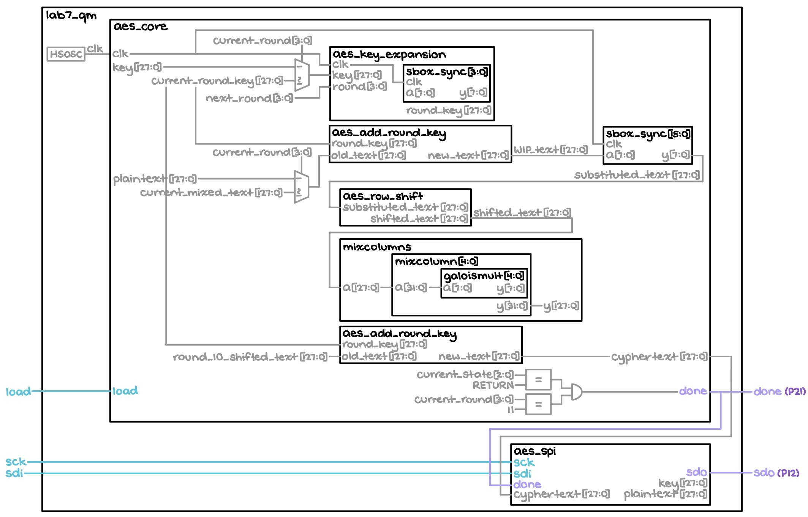{#fig-block-diagram}

The block diagram in [Figure 1](#fig-block-diagram) depicts the general architecture implied by the SystemVerilog code.
The top-level module, titled "*lab7_qm*," comprises a high-speed oscillator module that generates a 48 MHz signal, which is immediately fed to the rest of the time-dependent components that make up "*aes_core*."
One such component is the "*aes_key_expansion*" module, which makes use of "*sbox_sync*" to generate the round keys for each round of the encryption process; note that outside of this, "*sbox_sync*" is more generally used to repeatedly replace bytes in the text being encrypted in the interest of increased security.
Meanwhile, the "*aes_add_round_key*" block takes the current round key and applies it to the text, while "*aes_row_shift*" shifts the bytes in each row according to the prescribed algorithm.
Then, the message goes through "*mixcolumns*," which actually comprises multiple copies of the "*mixcolumn*" and "*galoismult*" modules.
Together, they apply Galois field theory to perform further, more complicated encryption (at the moment, this goes beyond the scope of this project, however).
Finally, there is the "*aes_spi*" block, which allows the FPGA to receive the key and plaintext from the MCU, and send back the ciphertext accordingly.

### Finite State Machine Design {#sec-fsm-design}
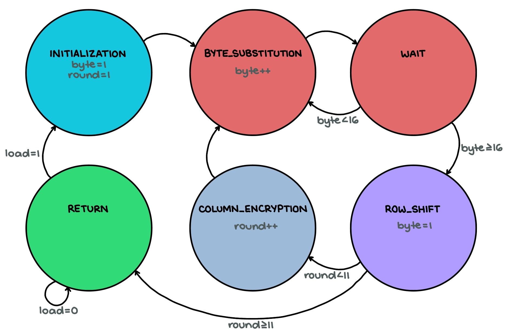{#fig-fsm-diagram}

The [Figure 2](#fig-fsm-diagram) FSM illustrates (and is labeled based on) the main stages of the AES algorithm — byte substitution, row shifting, column mixing, and key addition.

## Results and Discussion {#sec-results-and-discussion}
The results of Lab 6 are shown in [Figure 3](#fig-video), as follows:

::: {#fig-video}


Demo video
:::

Evidently, all of the project's specs have been met.
The LEDs indicating accuracy turned on like they were supposed to for both test cases given in the starter code.

### Testbench Simulation

::: {#fig-waveforms-1 layout-ncol=3}
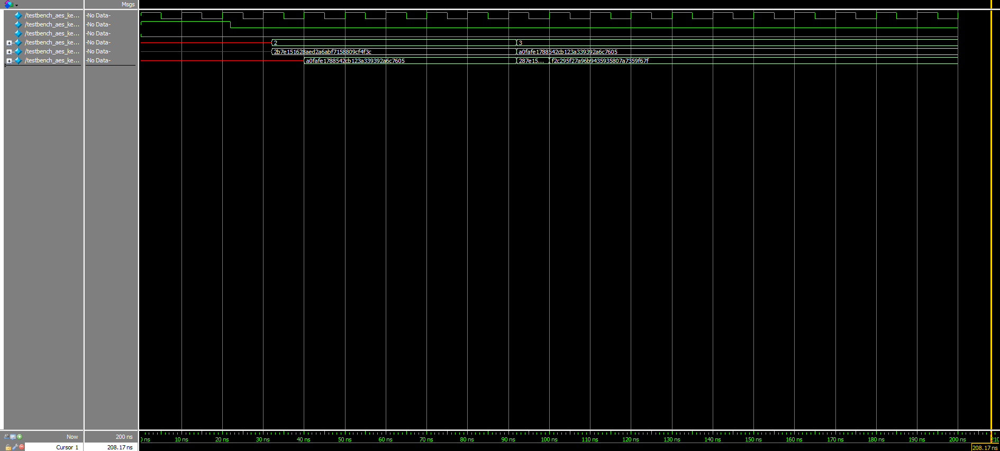{#fig-key-expansion-waveforms .lightbox}

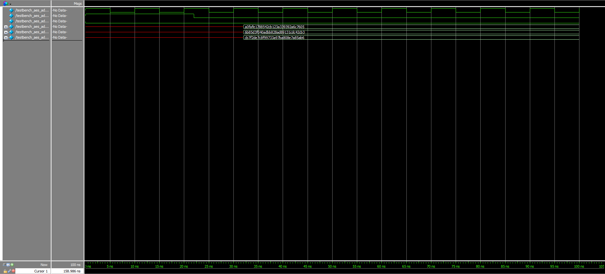{#fig-add-round-key-waveforms .lightbox}

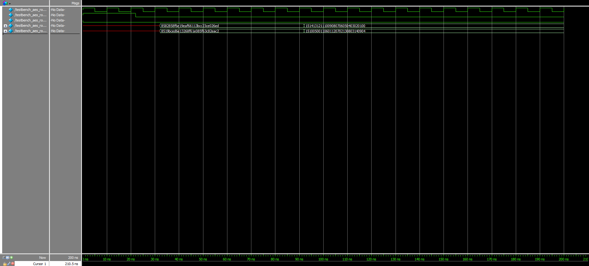{#fig-row-shift-waveforms .lightbox}

Original submodule traces
:::

The submodule waveforms in Figures [4a](#fig-key-expansion-waveforms), [4b](#fig-add-round-key-waveforms), and [4c](#fig-row-shift-waveforms) further verify that the design was working exactly as intended: The first two round keys matched the first two round keys from the Appendix B example in the [NIST documentation](https://hmc-e155.github.io/assets/doc/NIST.FIPS.197-upd1.pdf) perfectly (excluding the starting key, which did not need to pass through the "*aes_key_expansion*" module to begin with), the results of the round key addition also concurred with that found in the [interactive website's](https://legacy.cryptool.org/en/cto/aes-animation) example (found at the start of Round 2, specifically), and the row shift outputs were accurate to the results garnered when going through the AES algorithm by hand.

::: {#fig-waveforms-2 layout-ncol=3}
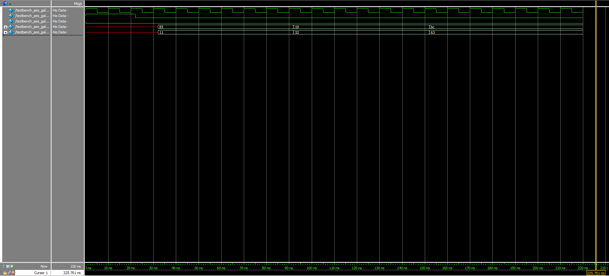{#fig-galoismult-waveforms .lightbox}

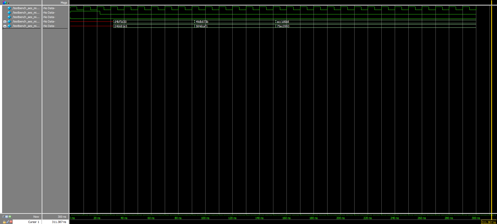{#fig-mixcolumn-waveforms .lightbox}

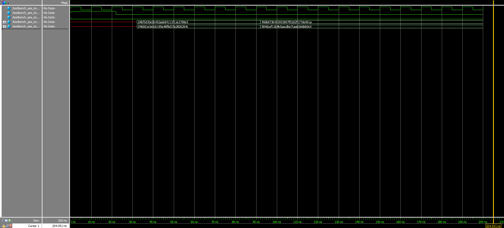{#fig-mixcolumns-waveforms .lightbox}

Given submodule traces
:::

Moreover, although already knowing that the given starter modules worked, testbenches were written for all of them, as well.
The corresponding waveforms for these can be viewed in Figures [5a](#fig-galoismult-waveforms), [5b](#fig-mixcolumn-waveforms), and [5c](#fig-mixcolumns-waveforms) above.

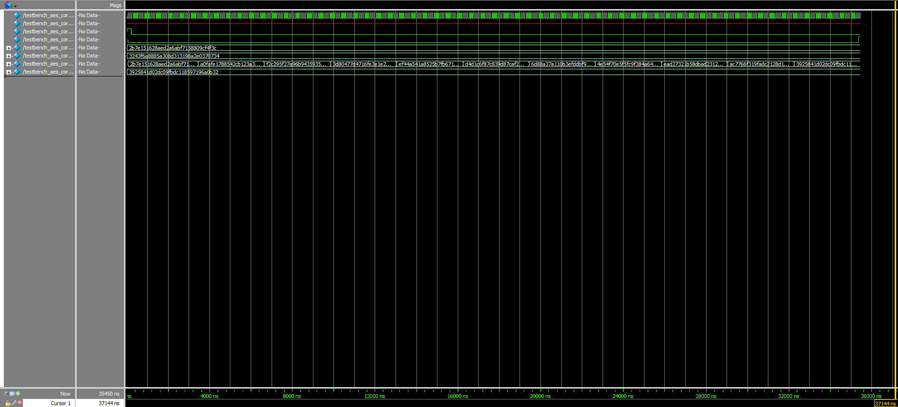{#fig-aes-core-waveforms}

Additionally, the AES core trace shown in [Figure 6](#fig-aes-core-waveforms) provides ample evidence of how the final *cyphertext* output, as depicted in the second-to-last row, eventually matches the expected one outlined on the very bottom.

::: {#fig-waveforms-3 layout-ncol=2}
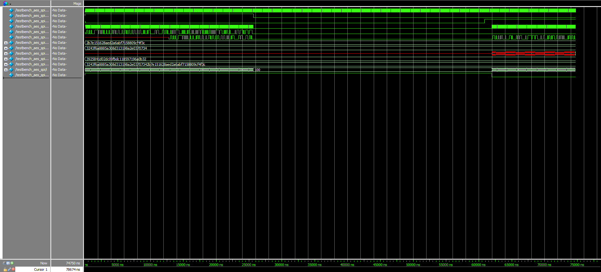{#fig-spi-1-waveforms .lightbox}

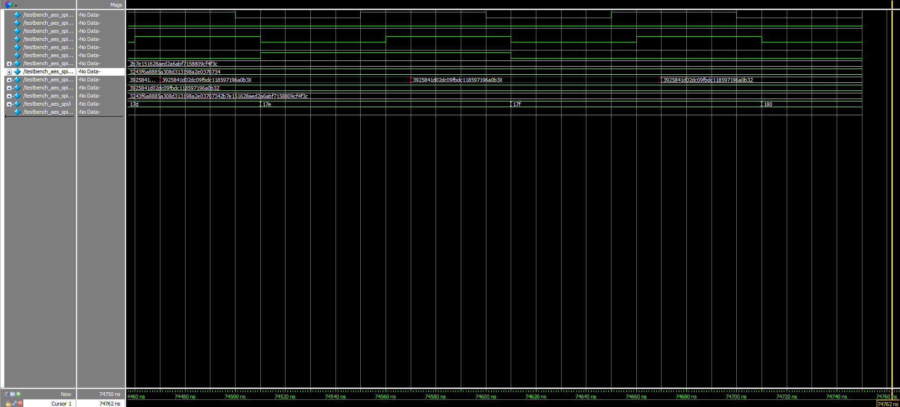{#fig-spi-2-waveforms .lightbox}

Top module traces
:::

Finally, Figures [7a](#fig-spi-1-waveforms) and [7b](#fig-spi-2-waveforms) depict the success of the design when tested as a whole.
As expected, the ninth and tenth signals are exactly the same at the very end of the testing process.

### Logic Analyzer Traces
Due to the excessive lengths of the keys/messages being sent over SPI, the Logic Analyzer traces that verify the accuracy and success of the transactions can be viewed in the Figure [8a](#fig-spi-write-trace) and [8b](#fig-spi-read-trace) videos below.
Note that there are also PDF versions of these traces available for both the [Write](images/spi_write.pdf) and [Read](images/spi_read.pdf) stages of the protocol.

::: {#fig-logic-analyzer-trace-videos layout-ncol=2}

::: {#fig-spi-write-trace}


SPI Write transaction
:::

::: {#fig-spi-read-trace}


SPI Read transaction
:::

Logic Analyzer traces on the oscilloscope
:::

Because the states of the SCLK, MISO (SDO/CIPO), and MOSI (SDI/COPI) signals matched what was expected from the messages pre-programmed into the aforementioned [starter code](https://github.com/HMC-E155/hmc-e155/tree/main/lab/lab07), it is safe to conclude that proper SPI communication has occurred.
(Note that due to the oscilloscope's poor resolution, some of the information during the Read process could not be properly detected and explicitly displayed; however, reasonable extrapolation allows us to make this assertion.)

## Conclusion
Overall, the design properly interfaced the FPGA and MCU in such a way that a key and plaintext were successfully sent from the latter to the former, and subsequently generated an accurate ciphertext result using the AES algorithm in response.
A total of approximately 16 hours was spent on this lab.

## AI Prototype
